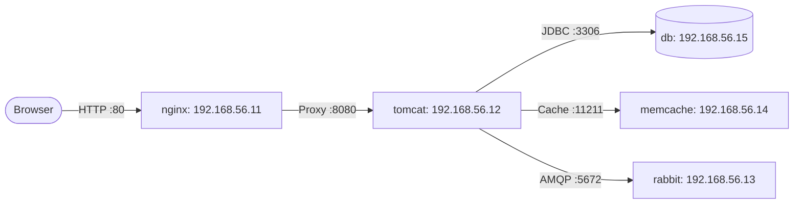

# 🛠️ 5-Tier Enterprise Web Application (Manual Setup)

This module demonstrates hands-on Linux system administration, database initialization, caching, message queuing, Java application packaging, and reverse proxying across 5 interconnected virtual machines.

---

## 📐 Architecture & Inventory

| VM Hostname | IP Address | OS Box | Role & Services |
| :--- | :--- | :--- | :--- |
| **`db`** | `192.168.56.15` | CentOS 7 | MariaDB / MySQL database storing application state |
| **`memcache`**| `192.168.56.14` | CentOS 7 | Memcached in-memory key-value cache (Port 11211) |
| **`rabbit`** | `192.168.56.13` | CentOS 7 | RabbitMQ AMQP message broker (Port 5672) |
| **`tomcat`** | `192.168.56.12` | CentOS 7 | OpenJDK 11, Tomcat 9, Maven, Spring Boot VProfile artifact |
| **`nginx`** | `192.168.56.11` | Ubuntu 22.04 LTS | Nginx load balancer / reverse proxy routing traffic to Tomcat |



---

## 📖 Execution Guide

Please follow [COMMANDS.md](COMMANDS.md) for the complete, step-by-step commands required to configure and connect each service.

---

## 🚀 Getting Started

```bash
# Ensure hostmanager plugin is installed
vagrant plugin install vagrant-hostmanager

# Bring up all 5 VMs
vagrant up

# SSH into machines as needed
vagrant ssh db
vagrant ssh memcache
vagrant ssh rabbit
vagrant ssh tomcat
vagrant ssh nginx
```

---

## 🧹 Teardown

```bash
# Halt VMs
vagrant halt

# Destroy VMs when finished
vagrant destroy -f
```
