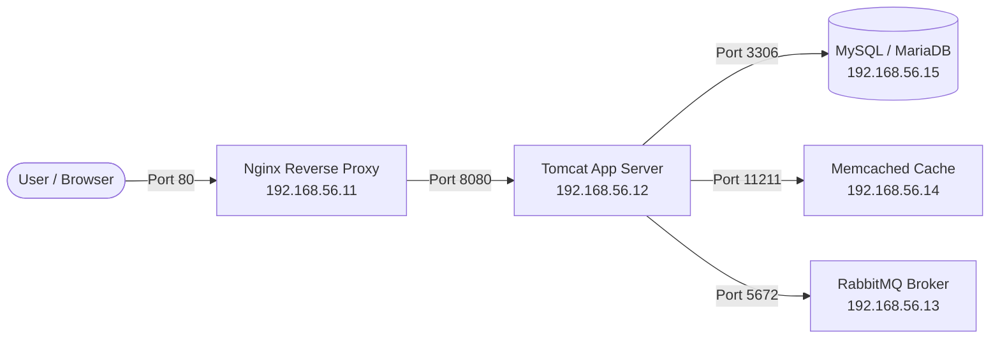
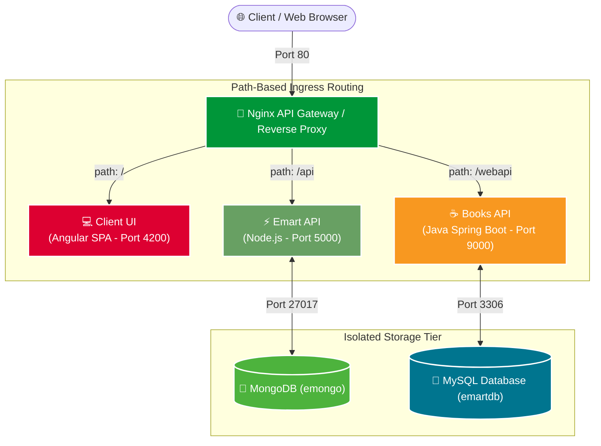

# 🚀 DevOps Engineering Lab & Multi-Tier Projects

<div align="center">


<br/>


<p align="center">
  <b>A continuous, hands-on journey from local multi-VM virtualized environments to containerized polyglot microservices, automated enterprise infrastructure, code analysis, and cloud delivery.</b>
</p>

</div>

---

> [!NOTE]
> ### 🚧 Project Status & Attribution
> This repository is an evolving DevOps portfolio and learning hub developed as part of the course **`DevOps Beginners to Advanced`** by **Imran Teli**.
> Special credits to **Imran Teli** and his projects repository. Modules are continuously added as separate feature/project branches as I progress through real-world DevOps architectures.

---

## 🛠️ Core Technologies & Tooling

| Category | Technologies & Tools | Purpose in Projects |
| :--- | :--- | :--- |
| **Virtualization & OS** | **Linux** (CentOS 7, Ubuntu 22.04), **VMs**, **Vagrant** | Multi-node guest provisioning, private networking, and host-guest synchronization. |
| **Containers & Orchestration** | **Docker**, **Docker Compose**, **Multi-Stage Builds** | Process isolation, packaging polyglot stacks, and orchestrating interconnected services. |
| **Web & API Gateways** | **Nginx**, **Apache Tomcat** | Reverse proxy, path-based API gateway routing (`/`, `/api`, `/webapi`), and Java app hosting. |
| **Application Runtimes** | **Java (Spring Boot / OpenJDK)**, **Node.js (Express)**, **Angular** | Microservices business logic, REST APIs, and client single-page frontend. |
| **Data & Cache** | **MySQL / MariaDB**, **MongoDB**, **Memcached** | Relational data persistence, NoSQL document stores, and sub-millisecond memory caching. |
| **Messaging & Queues** | **RabbitMQ** | Asynchronous message broker, task queues, and decoupling inter-service dependencies. |
| **Code Quality & CI/CD** | **SonarQube (Sonar)**, **Maven**, **Git** | Static code analysis, quality gates, dependency packaging, and version control. |

---

## 📚 Project Modules & Branch Index

Every project module lives in its own dedicated Git branch with isolated configurations, scripts, and documentation:

| Module | Branch Name | Status | Tech Stack | Highlights | Switch Command |
| :---: | :--- | :---: | :--- | :--- | :--- |
| **01** | [`multi-vm`](#-1-multi-vm-setup-multi-vm) | ✅ Completed | Linux (CentOS, Ubuntu), VMs, Vagrant, Domains | Dual-VM setup hosting static web template & LAMP WordPress stack. | `git checkout multi-vm` |
| **02** | [`local-setup-manual`](#-2-enterprise-5-tier-web-architecture-local-setup-manual--local-setup-automated) | ✅ Completed | Linux, VMs, MySQL/MariaDB, Memcache, RabbitMQ, Tomcat, Nginx | 5-Tier enterprise Java stack configured manually step-by-step. | `git checkout local-setup-manual` |
| **03** | [`local-setup-automated`](#-2-enterprise-5-tier-web-architecture-local-setup-manual--local-setup-automated) | ✅ Completed | Vagrant Shell Provisioning, Bash, Linux Services | Fully automated deployment of the 5-tier architecture via Bash scripts. | `git checkout local-setup-automated` |
| **04** | [`containers-intro`](https://github.com/BolohanAndrei/DevOps/tree/containers-intro) | ✅ Completed | Docker, Multi-Stage Builds, Docker Compose, Vagrant | Introduction to containerization, image layering, and container lifecycle. | `git checkout containers-intro` |
| **05** | [`conatiners-intro-microservices`](https://github.com/BolohanAndrei/DevOps/tree/conatiners-intro-microservices) | ✅ Completed | Docker, Compose, Nginx (API Gateway), Node.js, Java, Mongo, MySQL, Angular | Polyglot Emart microservices with path-based API gateway routing and container isolation. | `git checkout conatiners-intro-microservices` |

---

## 🏛️ System Architectures

### 1. Multi-VM Setup (`multi-vm`)

- **`website` (192.168.33.15)**: CentOS 7 with Apache HTTPD serving a responsive web template.
- **`wordpress` (192.168.33.16)**: Ubuntu 22.04 LTS running a full LAMP stack with WordPress and MySQL.

---

### 2. Monolithic Enterprise 5-Tier Web Architecture (`local-setup-manual` & `local-setup-automated`)



---

### 3. Emart Polyglot Microservices & API Gateway (`conatiners-intro-microservices`)

Solves the **isolation problem** of running disparate runtimes (Node.js, Java, MongoDB, MySQL, Angular) on shared infrastructure by containerizing each service and routing all traffic through an Nginx API Gateway:



| Ingress Path | Target Service | Runtime | Database Backend | Functionality |
| :--- | :--- | :--- | :--- | :--- |
| **`/`** | `client` | Angular (SPA) | N/A | Frontend web store UI |
| **`/api`** | `api` | Node.js / Express | MongoDB (`emongo`) | Emart catalog, cart state, user session |
| **`/webapi`** | `webapi` | Java (Spring Boot) | MySQL (`emartdb`) | Books inventory, stock, and relational records |

---

## 💻 Prerequisites & Environment Setup

Ensure the following tools are installed on your workstation:
- [VirtualBox](https://www.virtualbox.org/)
- [Vagrant](https://developer.hashicorp.com/vagrant/install)
- [Docker Engine & Docker Compose](https://docs.docker.com/engine/install/)
- Vagrant Hostmanager Plugin:
  ```bash
  vagrant plugin install vagrant-hostmanager
  ```

---

## 🧭 How to Navigate & Run Projects

Each branch is structured so you can run the project directly at the root:

```bash
# 1. Clone the repository
git clone https://github.com/BolohanAndrei/DevOps.git
cd DevOps

# 2. View all project branches
git branch -a

# 3. Switch into a project branch
git checkout multi-vm
# or
git checkout local-setup-manual
# or
git checkout local-setup-automated
# or
git checkout containers-intro
# or
git checkout conatiners-intro-microservices

# 4. Launch the environment
vagrant up
```

---

## 📌 Repository Roadmap

- [x] Multi-VM basic hosting (Website + WordPress LAMP)
- [x] Multi-tier Enterprise Architecture (Manual step-by-step: Nginx, Tomcat, RabbitMQ, Memcache, MySQL)
- [x] Infrastructure as Code (Automated Bash provisioning)
- [x] Containerization Basics (`containers-intro`)
- [x] Polyglot Microservices & API Gateway (`conatiners-intro-microservices`)

---

## 🎓 Course & Repository Credits

- **Course**: Developed following the **`DevOps Beginners to Advanced`** course by **Imran Teli**.
- **Source Repository**: Special credits to **Imran Teli** and his projects repository.
