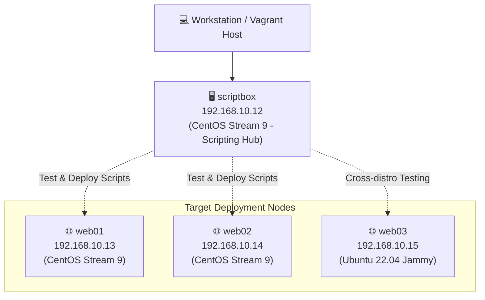

# 📜 Bash Scripts: Automation & Multi-VM Testing Lab

> [!NOTE]
> ### 🎓 Course & Project Attribution
> This module is developed as part of the **`DevOps Beginners to Advanced`** course by **Imran Teli**.
> Special credits to **Imran Teli** and his project repository.

---

## 📌 Branch Overview

The **`bash-scripts`** branch focuses on practical Linux automation fundamentals using Bash scripts. 

Instead of configuring servers manually, we write reusable shell scripts to inspect server health, install packages, manage system services, and deploy static web applications across a local multi-VM environment provisioned with **Vagrant**.

---

## 🏛️ Lab Architecture & Environment

The local testing lab consists of **4 virtual machines** connected via a private network (`192.168.10.0/24`):



### VM Specifications:
| Node Name | Operating System | IP Address | Role | Memory |
| :--- | :--- | :--- | :--- | :--- |
| **`scriptbox`** | CentOS Stream 9 | `192.168.10.12` | Scripting station & test runner | 1024 MB |
| **`web01`** | CentOS Stream 9 | `192.168.10.13` | Web server target node 1 | 512 MB |
| **`web02`** | CentOS Stream 9 | `192.168.10.14` | Web server target node 2 | 512 MB |
| **`web03`** | Ubuntu 22.04 (Jammy) | `192.168.10.15` | Cross-distro Debian/Ubuntu target | 512 MB |

---

## 📂 Included Scripts

All scripts are located in the [`scripts/`](file:///D:/DevOps/scripts/) folder:

### 1. [`firstscript.sh`]
A health check script that reports:
* Current system uptime and load averages (`uptime`)
* Available and used RAM in megabytes (`free -m`)
* Filesystem disk space utilization (`df -h`)

### 2. [`websetup.sh`]
An end-to-end automated deployment script for Apache HTTPD:
* Installs `httpd`, `wget`, and `unzip`
* Enables and starts the `httpd` systemd service
* Downloads the **Orbital** HTML5 template from Tooplate
* Deploys website assets into `/var/www/html/`
* Restarts the web service and verifies running status

---

## 🚀 Quick Start

```bash
# 1. Boot up the primary scripting VM
vagrant up scriptbox

# 2. SSH into scriptbox
vagrant ssh scriptbox

# 3. Navigate to the scripts directory and execute
cd /opt/scripts
./firstscript.sh
./websetup.sh
```

---

## 📖 Command Reference

For step-by-step terminal execution, permissions setup, and multi-node testing instructions, see **[commands.md]**.
