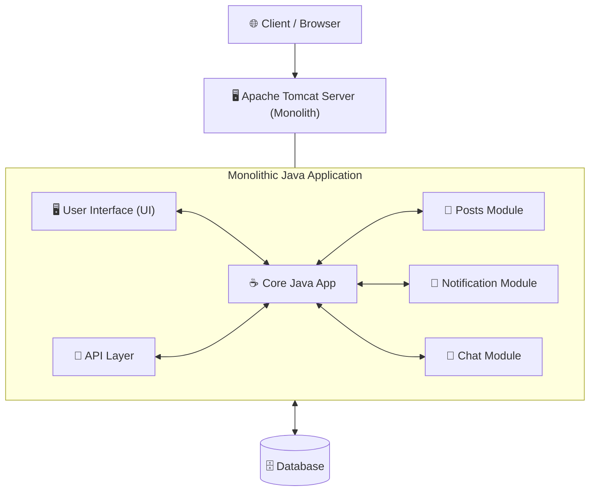
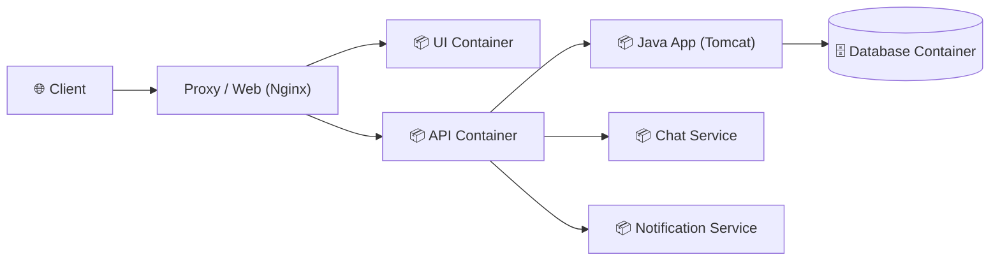

# 📦 Containers Intro: Monolithic Architecture to Containerization

Welcome to the **`containers-intro`** branch! This module introduces containerization fundamentals, contrasting a traditional monolithic application running on an Apache Tomcat server with a modern containerized workflow powered by **Docker**, **Docker Compose**, and automated provisioning via **Vagrant**.

---
> [!NOTE]
> ### 🎓 Course & Project Attribution
> This module is developed as part of the **`DevOps Beginners to Advanced`** course by **Imran Teli**.
> Special credits to **Imran Teli** and his project repositories: [devopshydclub/vprofile-project](https://github.com/devopshydclub/vprofile-project).
---

## 📌 What is This Branch About?

In software development and DevOps, applications historically lived inside a single monolithic runtime. In this branch, we explore:
1. **The Monolithic Model**: Understanding how a tightly coupled Tomcat Java stack operates and its limitations.
2. **Container Fundamentals**: Running standalone containers, port forwarding, and image lifecycle management.
3. **Multi-Stage Dockerfiles**: Building optimized, clean container images separating the build stage from runtime.
4. **Multi-Container Environments**: Managing multi-tier microservices and application stacks using **Docker Compose**.
5. **Infrastructure as Code (IaC)**: Automating the local Linux sandbox environment with a configured [Vagrantfile].

---

## 🏛️ Architecture: Monolithic vs. Containerized

### The Monolithic Architecture (Tomcat Server)

In a traditional monolithic setup, all features and services are packaged together and deployed onto a single **Apache Tomcat** application server:



#### Monolith Components:
* **Tomcat Server**: The single servlet container hosting the entire `.war` package.
* **User Interface (UI)**: The frontend views served directly by the web tier.
* **Java App**: The core business logic orchestrating operations.
* **API**: Internal and external REST endpoints serving application data.
* **Posts**: Handles user feed and content submission.
* **Notification**: Dispatches in-app and push notifications.
* **Chat**: Real-time communication module.

#### ⚠️ Challenges of the Monolith:
* **Single Point of Failure**: A bug or memory leak in the Chat or Notification module can crash the entire Tomcat instance.
* **Scalability Bottlenecks**: High traffic on Posts requires scaling the whole monolith rather than just the needed service.
* **Tight Coupling**: Deploying a small UI change requires redeploying the entire Java application.

---

### The Containerized Vision

Containerization decouples each component into lightweight, isolated containers:



Each container packages its own runtime, dependencies, and configuration, ensuring portability and independent scaling.

---

## 🚀 Environment Setup

This project uses a reproducible **Ubuntu 22.04 LTS (Jammy)** Virtual Machine managed via **Vagrant** and **VirtualBox** with Docker pre-installed.

### Quick Start:
```bash
# 1. Boot up the VM
vagrant up

# 2. SSH into the Ubuntu environment
vagrant ssh

# 3. Verify Docker is running
docker --version
docker run --rm hello-world
```

---

## 📂 Repository Structure

```text
.
├── Vagrantfile      # Automated VM provisioning (Ubuntu Jammy + Docker Engine)
├── README.md        # Architecture overview and branch documentation
├── commands.md      # Step-by-step hands-on terminal command guide
└── comenzi.txt      # Raw lab command notes
```

---

## 📖 Next Steps

Head over to **[commands.md](/commands.md)** for the complete hands-on guide covering:
* Nginx container deployment & port mapping
* Multi-stage Dockerfile creation
* Stopping and cleaning up containers & images
* Deploying multi-container stacks with Docker Compose
