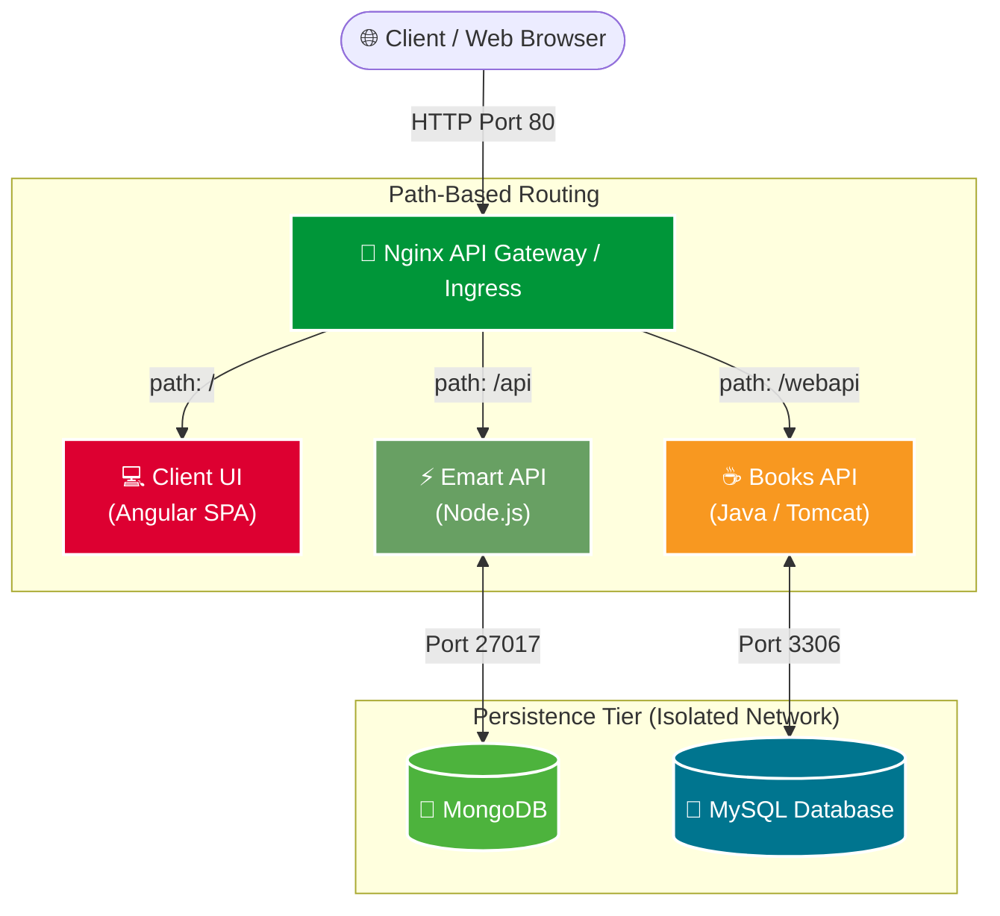

# 🛍️ Microservices Architecture: From Isolation Problems to Containerization

> [!NOTE]
>
> ### 🎓 Course & Project Attribution
>
> This module is developed as part of the **`DevOps Beginners to Advanced`** course by **Imran Teli**.
> Special credits to **Imran Teli** and his project repositories: [devopshydclub/emartapp](https://github.com/devopshydclub/emartapp).

---

## 📌 Executive Summary

In a modern enterprise, applications evolve from monolithic runtimes into **Microservices Architectures** where independent services are developed using polyglot technology stacks (**Node.js, Java, Python, Angular, MySQL, MongoDB**).

Running these diverse runtimes across multiple traditional servers creates severe **isolation, dependency, and scalability challenges**. This project showcases how to solve these problems by containerizing each microservice with **Docker** and coordinating ingress routing via an **Nginx API Gateway**.

---

## ⚠️ The Problem: Why Microservices Cause Isolation Issues

In a microservices ecosystem, every business capability is powered by a specialized technology stack:

```text
┌────────────────────────────────────────────────────────────────────────┐
│                        Polyglot Microservices                          │
│                                                                        │
│   [ Angular (Node/Nginx) ]   [ Emart API (Node.js) ]   [ Books API (Java) ] │
│   [ MongoDB Database ]       [ MySQL Relational DB ]   [ Python Services ]  │
└────────────────────────────────────────────────────────────────────────┘
```

### The Traditional Multi-Server Dilemma:

1. **Dependency Hell**: Running Node.js, multiple Java versions (JDK 11 / JDK 17), Python libraries, and databases on shared servers leads to conflicting system packages and libraries.
2. **High Resource Overhead**: Spinning up a separate Virtual Machine for every single service consumes excessive CPU, RAM, and storage for OS kernels.
3. **Port Collisions**: Different services trying to bind to standard ports on the same host machine.
4. **Environment Discrepancies**: "It works on my machine" failures due to subtle configuration drifts across servers.

### 💡 The Solution: Containerization

- **Complete Process Isolation**: Each service packages its own binaries, libraries, and configurations into a lightweight container.
- **Shared Kernel Efficiency**: Run dozens of isolated containers on a single host without the overhead of multiple guest operating systems.
- **Internal DNS & Software Networking**: Containers communicate over private Docker networks using service names instead of hardcoded IPs.

---

## 🏛️ Emart Architecture & API Gateway

The **Emart** system uses **Nginx as a reverse proxy and API Gateway** that acts as the single public entry point, routing client traffic to the appropriate backend microservice based on URL paths:



### Routing & Service Specification

| Ingress Path  | Destination Service | Technology Stack            | Backend Storage       | Responsibilities                                          |
| :------------ | :------------------ | :-------------------------- | :-------------------- | :-------------------------------------------------------- |
| **`/`**       | **Client Frontend** | Angular, Nginx              | Browser Storage / CDN | User Interface, product browsing, cart views.             |
| **`/api`**    | **Emart API**       | Node.js / Express           | MongoDB (NoSQL)       | User authentication, orders, cart session management.     |
| **`/webapi`** | **Books API**       | Java (Spring Boot / Tomcat) | MySQL (Relational)    | Catalog management, book inventory, relational reporting. |

---

## 🛠️ Technology Stack & Isolation Matrix

```
┌─────────────────┬──────────────────┬──────────────────┬─────────────────┐
│ Service         │ Base Runtime     │ Container Port   │ Gateway Path    │
├─────────────────┼──────────────────┼──────────────────┼─────────────────┤
│ API Gateway     │ nginx:alpine     │ 80 (Exposed)     │ / , /api, /webapi│
│ Client Web UI   │ angular / nginx  │ 80 (Internal)    │ /               │
│ Emart API       │ node:18-alpine   │ 5000 (Internal)  │ /api            │
│ MongoDB         │ mongo:6.0        │ 27017 (Internal) │ None (Private)  │
│ Books API       │ openjdk / tomcat │ 8080 (Internal)  │ /webapi         │
│ MySQL Database  │ mysql:8.0        │ 3306 (Internal)  │ None (Private)  │
└─────────────────┴──────────────────┴──────────────────┴─────────────────┘
```

---

## 🚀 Environment Setup

The containerized microservices run inside a local Ubuntu VM provisioned with Vagrant:

```bash
# 1. Start the VM environment
vagrant up

# 2. Access the VM
vagrant ssh

# 3. Verify Docker and Docker Compose
docker --version
docker compose version
```

---

## 📖 Command Guide

For hands-on execution, individual Dockerfiles, and the complete `docker-compose.yml` configuration, see **[commands.md]**:

- Creating Dockerfiles for Angular, Node.js, and Java
- Writing the Nginx Gateway `nginx.conf`
- Orchestrating the full multi-tier stack with Docker Compose
- Verifying path-based routing (`/`, `/api`, `/webapi`)
